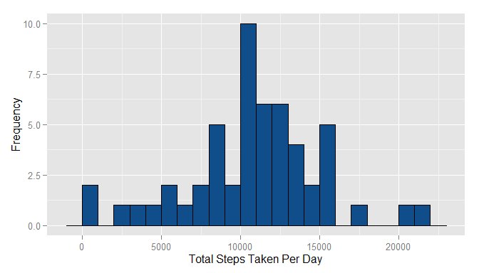
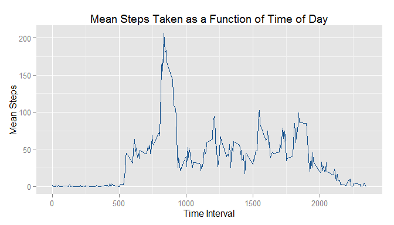
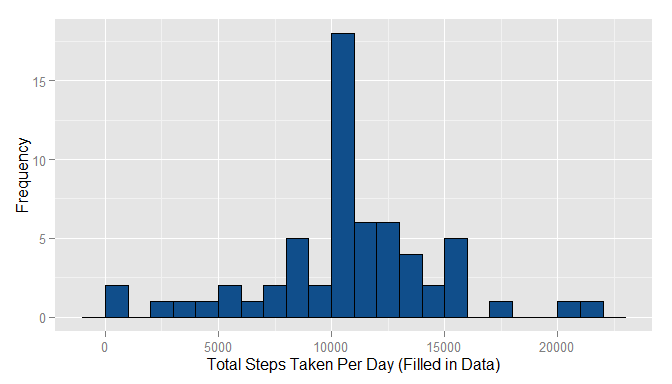
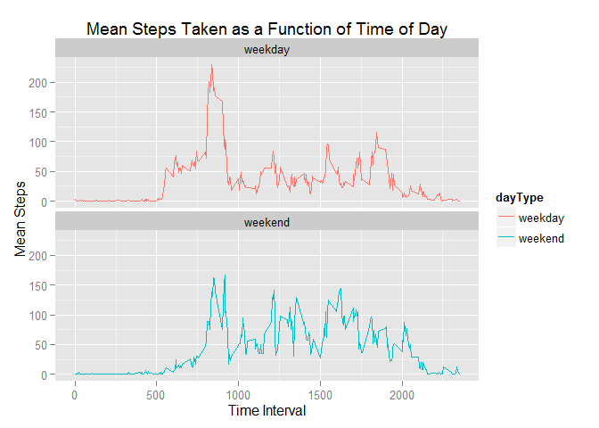

# Reproducible Research: Peer Assessment 1


## Loading and preprocessing the data

The activity.zip file is unzipped, the zipped csv file is read into R, and then pre-processed by converting the date to POSIXct/POSIXt format using the ymd function in the lubridate package. Note: the activity.zip file must be in the working directory.  


```r
library(knitr)
opts_chunk$set(warning=FALSE)
setwd("F:/Documents/Education/Coursera_DataScience/RepData_PeerAssessment1")
```


```r
library(lubridate)
unzip("./activity.zip",overwrite=TRUE)
activity <- read.csv("./activity.csv",header=TRUE,na.strings="NA",stringsAsFactors=FALSE,colClasses=c("numeric","character","numeric"))
activity$dateFactor <- as.factor(activity$date)
activity$date <- ymd(activity$date)
```

## What is mean total number of steps taken per day?
The activity dateframe is subsetted to include only those values with steps measured (i.e., non-NA values). The total steps per day are calculated and then dislayed as a histogram below, along with the mean and median total steps per day.  


```r
library(ggplot2)
activeDays <- activity[!is.na(activity$steps),]
totalSteps <- tapply(activeDays$steps,activeDays$dateFactor,sum)
totalSteps <- as.data.frame(totalSteps)
totalSteps$date <- as.factor(row.names(totalSteps))
names(totalSteps) <- c("totSteps","date")
stepHisto <- ggplot(totalSteps,aes(x=totSteps)) + geom_histogram(binwidth=1000,color="black",fill="dodgerblue4") + labs(x="Total Steps Taken Per Day",y="Frequency")
print(stepHisto)
```

 

```r
meanTotSteps <- mean(totalSteps$totSteps,na.rm=TRUE)
meanTotSteps
```

```
## [1] 10766.19
```

```r
medianTotSteps <- median(totalSteps$totSteps,na.rm=TRUE)
medianTotSteps
```

```
## [1] 10765
```

The mean total number of steps taken per day is 1.0766189\times 10^{4} and the median total number of steps taken per day is 1.0765\times 10^{4}.  

## What is the average daily activity pattern?

```r
activeDays$intFactor <- factor(activeDays$interval)
meanStepPattern <- as.data.frame(tapply(activeDays$steps,activeDays$intFactor,mean))
meanStepPattern$interval <- as.numeric(row.names(meanStepPattern))
names(meanStepPattern) <- c("meanSteps","interval")
maxInt <- meanStepPattern$interval[which.max(meanStepPattern$meanSteps)]
pattern <- ggplot(meanStepPattern,aes(x=interval,y=meanSteps)) + geom_line(color="dodgerblue4") + labs(x="Time Interval",y="Mean Steps",title="Mean Steps Taken as a Function of Time of Day")
print(pattern)
```

 

```r
maxInt
```

```
## [1] 835
```
The 5-minute time interval during which, on average, the most steps are taken is 835.  

## Inputing missing values

```r
numNA <- sum(is.na(activity$steps))
numNA
```

```
## [1] 2304
```

```r
daysNA <- numNA/8
idxNA <- which(is.na(activity$steps))
activity.fill <- activity
meanStepPattern$meanStepsRound <- round(meanStepPattern$meanSteps)
for (i in 1:length(idxNA)) {
    activity.fill$steps[idxNA[i]] <- meanStepPattern$meanStepsRound[meanStepPattern$interval==activity.fill$interval[idxNA[i]]]
}

totalStepsFill <- tapply(activity.fill$steps,activity.fill$dateFactor,sum)
totalStepsFill <- as.data.frame(totalStepsFill)
totalStepsFill$date <- as.factor(row.names(totalStepsFill))
names(totalStepsFill) <- c("totSteps","date")
```
The number of missing values (i.e., rows with NA for the step value) is 2304, which corresponds to 288 days of missing values. The missing values (NAs) were filled in using the mean number of steps for that interval across all days, rounded to the nearest integer. A histogram of the total number of steps taken per day with the filled in data is shown below.  


```r
stepHisto2 <- ggplot(totalStepsFill,aes(x=totSteps)) + geom_histogram(binwidth=1000,color="black",fill="dodgerblue4") + labs(x="Total Steps Taken Per Day (Filled in Data)",y="Frequency")
print(stepHisto2)
```

 

```r
stepHistoData <- hist(totalSteps$totSteps,plot=FALSE,breaks=25)
maxFreqIdx <- which.max(stepHistoData$counts)
maxFreq <- stepHistoData$counts[maxFreqIdx]
maxLowRange <- stepHistoData$breaks[maxFreqIdx]
maxHighRange <- stepHistoData$breaks[maxFreqIdx+1]

stepHistoData2 <- hist(totalStepsFill$totSteps,plot=FALSE,breaks=25)
maxFreqIdx2 <- which.max(stepHistoData2$counts)
maxFreq2 <- stepHistoData2$counts[maxFreqIdx2]
maxLowRange2 <- stepHistoData2$breaks[maxFreqIdx2]
maxHighRange2 <- stepHistoData2$breaks[maxFreqIdx2+1]

totStepImpact <- "The inputting of rounded mean values for missing (NA) values "

if ((maxLowRange2 == maxLowRange) & (maxHighRange2 == maxHighRange)) {
    totStepImpact <- paste0(totStepImpact,"did not impact the most frequent total number of steps per day, ranging from ",maxLowRange," to ",maxHighRange,". ")
} else {
    totStepImpact <- paste0(totStepImpact,"impacted the most frequent total number of steps per day, originally from ",maxLowRange,"-",maxHighRange," to ",maxLowRange2,"-",maxHighRange2,". ")
}

if (maxFreq2 == maxFreq) {
    totStepImpact <- paste0(totStepImpact,"The inputting of rounded mean values for missing (NA) values did not impact the maximum frequency (count) of total number of steps per day.")
} else {
    totStepImpact <- paste0(totStepImpact,"The inputting of rounded mean values for missing (NA) values changed the maximum frequency (count) of total number of steps per day from ",maxFreq," to ",maxFreq2,".\n")
}

meanTotStepsFill <- mean(totalStepsFill$totSteps,na.rm=TRUE)
meanTotStepsFill
```

```
## [1] 10765.64
```

```r
medianTotStepsFill <- median(totalStepsFill$totSteps,na.rm=TRUE)
medianTotStepsFill
```

```
## [1] 10762
```
For the filled in data, the mean total number of steps taken per day is 1.0765639\times 10^{4} and the median total number of steps taken per day is 1.0762\times 10^{4}. The difference in the mean total number of steps between the filled in data and the raw data is -0.549335 and the difference in median number of steps is -3. While the changes to the mean and the median number of steps taken per day is minimal (-0.0051024%), there was a significant change in the distribution of the total number of steps taken per day. The inputting of rounded mean values for missing (NA) values did not impact the most frequent total number of steps per day, ranging from 10000 to 11000. The inputting of rounded mean values for missing (NA) values changed the maximum frequency (count) of total number of steps per day from 10 to 18.
  

## Are there differences in activity patterns between weekdays and weekends?

```r
activity.fill$dayOfWeek <- weekdays(activity.fill$date)
activity.fill$dayType <- factor(rep(NA,nrow(activity.fill)),levels=c("weekday","weekend"))
activity.fill$dayType[activity.fill$dayOfWeek %in% c("Saturday","Sunday")] <- "weekend"
activity.fill$dayType[is.na(activity.fill$dayType)] <- "weekday"

pattern2 <- ggplot(activity.fill,aes(x=interval,y=steps, color=dayType)) + stat_summary(fun.y=mean,geom="line") + facet_wrap(~dayType, nrow=2) + labs(x="Time Interval",y="Mean Steps",title="Mean Steps Taken as a Function of Time of Day")
print(pattern2)
```

 
  
There are differences in the steps taken activity patterns between weekdays and weekends, as shown in the plot above. During the weekdays, on average more steps are taken earlier in the day (approximately 0530 to 0730). On the weekends, on average more steps are taken between 2000 to 2100.
